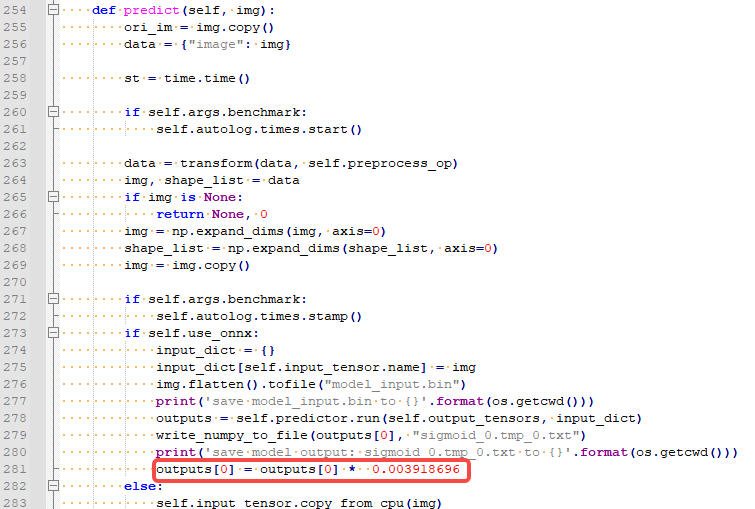
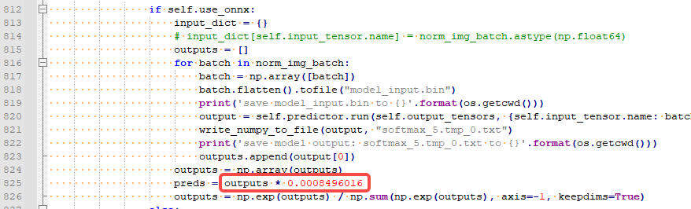

# PaddleOCR for PaddlePaddle

<!--命名规则 {model_name}-{dataset}-{framework}-->

[TOC]

## 模型简介

PaddleOCR 旨在打造一套丰富、领先、且实用的 OCR 工具库，助力开发者训练出更好的模型，并应用落地。

Github工程地址：https://github.com/PaddlePaddle/PaddleOCR


## 资源准备

1. 数据集及权重下载

	百度网盘： [ocrV3](https://pan.baidu.com/s/173L2VeLompYU5AbDKnGqsQ?pwd=985b)

2. 清微github modelzoo仓库下载

	```git clone https://github.com/tsingmicro-toolchain/ts.knight-modelzoo.git```

## Knight环境准备

1. 联系清微智能获取Knight工具链版本包 ```ReleaseDeliverables/ts.knight-x.x.x.x.tar.gz ```以及定点模型加速代码。下面以ts.knight-3.0.0.11.build1.tar.gz为例演示。

2. 检查docker环境

	​默认服务器中已安装docker（版本>=19.03）, 如未安装可参考文档ReleaseDocuments/《TS.Knight-使用指南综述_V3.0.11.pdf》。
	
	```
	docker -v   
	```

3. 加载镜像
	
	```
	docker load -i ts.knight-3.0.0.11.build1.tar.gz
	```

4. 启动docker容器

	```
	docker run -v ${localhost_dir}/ts.knight-modelzoo:/ts.knight-modelzoo -it ts.knight:3.0.0.11.build1 /bin/bash
	```
	
	localhost_dir为宿主机目录。


## 模型部署流程

### 1. 量化&编译

-   模型准备
	
	如上述"Knight环境准备"章节所述，准备好ocrV3的paddlepaddle权重文件放到`weight`下，paddleOCR工程文件放到`src`下。
	

-   量化数据准备

    将百度网盘下载好的数据放在`${localhost_dir}/ts.knight-modelzoo/paddlepaddle/builtin/cv/ocr/ocrV3/data/`下。

-   模型转换函数、推理函数准备
	
	已提供量化依赖的模型转换和推理函数py文件: ```/ts.knight-modelzoo/paddlepaddle/builtin/cv/ocr/ocrV3/src/infer_ocr.py```

-   执行量化及编译命令

	在容器内执行如下量化命令，具体量化、编译参数可见 `ocrV3_det_config.json、 ocrV3_rec_config.json、 ocrV3_cls_config.json `。

    	Knight --chip TX5368AV200 build --run-config data/ocrV3_cls_config.json
		Knight --chip TX5368AV200 build --run-config data/ocrV3_det_config.json
		Knight --chip TX5368AV200 build --run-config data/ocrV3_rec_config.json

-   量化后模型推理

	

		python replace_operator.py --model /TS-KnightDemo/Output/ocrV3_rec/quant/ocrV3_rec_quantize.onnx --output /TS-KnightDemo/Output/ocrV3_rec/quant/ocrV3_rec_quantize_speed.onnx
		python replace_operator.py --model /TS-KnightDemo/Output/ocrV3_det/quant/ocrV3_det_quantize.onnx --output /TS-KnightDemo/Output/ocrV3_det/quant/ocrV3_det_quantize_speed.onnx
		python replace_operator.py --model /TS-KnightDemo/Output/ocrV3_cls/quant/ocrV3_cls_quantize.onnx --output /TS-KnightDemo/Output/ocrV3_cls/quant/ocrV3_cls_quantize_speed.onnx
        
	需要修改tools/infer/predict_det.py中模型输出乘的反量化系数：

	
	
	需要修改tools/infer/predict_rec.py中模型输出乘的反量化系数：

	

    需要修改tools/infer/predict_clsc.py中模型输出乘的反量化系数：

	

		python3 tools/infer/predict_system.py --use_gpu=False --cls_model_dir=/TS-KnightDemo/Output/ocrV3_cls/quant/ocrV3_cls_quantize_speed.onnx --rec_model_dir=/TS-KnightDemo/Output/ocrV3_rec/quant/ocrV3_rec_quantize_speed.onnx --det_model_dir=/TS-KnightDemo/Output/ocrV3_det/quant/ocrV3_det_quantize_speed.onnx --image_dir=deploy/lite/imgs/lite_demo.png --use_onnx=True


