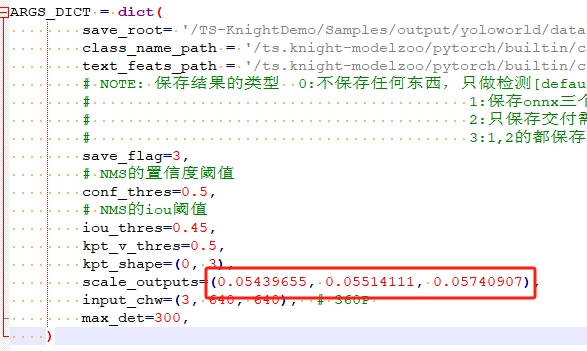

# YOLO-World for Pytorch

<!--命名规则 {model_name}-{dataset}-{framework}-->

[TOC]

## 模型简介


- YOLO-World is pre-trained on large-scale datasets, including detection, grounding, and image-text datasets.

- YOLO-World is the next-generation YOLO detector, with a strong open-vocabulary detection capability and grounding ability.

- YOLO-World presents a prompt-then-detect paradigm for efficient user-vocabulary inference, which re-parameterizes vocabulary embeddings as parameters into the model and achieve superior inference speed.


**Github工程地址：**[AILab-CVC/YOLO-World](https://github.com/AILab-CVC/YOLO-World/tree/master)


## 资源准备

1. 数据集资源下载

	下载量化数据集[coco128](https://github.com/ultralytics/yolov5/releases/download/v1.0/coco128_with_yaml.zip)或者[预训练模型数据集](https://github.com/AILab-CVC/YOLO-World/blob/master/docs/data.md)。
2. 模型权重下载
	
	以YOLO-World-s、 分辨率 640、 coco 80类别为例,直接下载ONNX模型YOLO-Wolds-S-640或者按以下步骤导出：

	- 下载[AILab-CVC/YOLO-World](https://github.com/AILab-CVC/YOLO-World/tree/master)工程
	
	- Export YOLO-World to ONNX models
	
	    1. [下载权重](https://hf-mirror.com/wondervictor/YOLO-World/resolve/main/yolo_world_v2_s_vlpan_bn_2e-4_80e_8gpus_mask-refine_finetune_coco_ep80-492dc329.pth?download=true)
		2. 导出onnx

		    `python src/export_onnx.py`
	- Get coco text features
	    
		`python src/get_class_feat.py`

3. 清微github modelzoo仓库下载

	```git clone https://github.com/tsingmicro-toolchain/ts.knight-modelzoo.git```

## Knight环境准备

1. 联系清微智能获取Knight工具链版本包 ```ReleaseDeliverables/ts.knight-x.x.x.x.tar.gz ```。下面以ts.knight:3.4.0.2.build3.tar.gz为例演示。

2. 检查docker环境

	​默认服务器中已安装docker（版本>=19.03）, 如未安装可参考文档ReleaseDocuments/《TS.Knight-使用指南综述_V3.4.2.pdf》。
	
	```
	docker -v   
	```

3. 加载镜像
	
	```
	docker load -i ts.knight-3.4.0.2.build3.tar.gz
	```

4. 启动docker容器

	```
	docker run -v ${localhost_dir}/ts.knight-modelzoo:/ts.knight-modelzoo -it ts.knight:3.4.0.2.build3 /bin/bash
	```
	
	localhost_dir为宿主机目录。


## 模型部署流程

### 1. 量化 & 编译

-   执行量化命令及编译

	在容器内执行如下量化命令，具体量化、编译参数可见yolo-world_config.json。

    	Knight build --run-config data/yolo-world_config.json

-   量化后模型推理
	
    首先需要修改infer_yoloworld.py反量化系数：

	
	
		Knight --chip TX5336AV200 quant --run-config data/yolo-world_infer_config.json


### 2. 仿真

    #准备bin数据
    python3 src/make_image_input_onnx.py  --input test_data/bus.jpg --outpath /TS-KnightDemo/Output/yolo-world/npu

    #仿真
    Knight --chip TX5336AV200 run --run-config data/yolo-world_config.json

	#仿真输出txt文件转numpy
	show_sim_result --sim-data /TS-KnightDemo/Output/yolo-world/npu/result-out0_p.txt --save-dir /TS-KnightDemo/Output/yolo-world/npu/
	show_sim_result --sim-data /TS-KnightDemo/Output/yolo-world/npu/result-out1_p.txt --save-dir /TS-KnightDemo/Output/yolo-world/npu/
	show_sim_result --sim-data /TS-KnightDemo/Output/yolo-world/npu/result-out2_p.txt --save-dir /TS-KnightDemo/Output/yolo-world/npu/

	#模型后处理。 scales为模型输出top_scale，需要根据实际量化结果指定该值
    python src/post_process.py --image test_data/bus.jpg --img-size 640 --numpys /TS-KnightDemo/Output/yolo-world/npu/result-out0_p.npy /TS-KnightDemo/Output/yolo-world/npu/result-out1_p.npy /TS-KnightDemo/Output/yolo-world/npu/result-out2_p.npy --scales  0.05439655 0.05514111 0.05740907 --save_dir /TS-KnightDemo/Output/yolo-world/npu/

### 3. 性能分析

```
Knight --chip TX5336AV200 profiling --run-config data/yolov8s_config.json
```

### 4. 仿真库

### 5. 板端部署


## 支持芯片情况

| 芯片系列                                          | 是否支持 |
| ------------------------------------------------ | ------- |
| TX510x                                           | 支持     |
| TX5368x_TX5339x                                  | 支持     |
| TX5215x_TX5239x200_TX5239x220 | 支持     |
| TX5112x201_TX5239x201                            | 支持     |
| TX5336AV200                                      | 支持     |


## 版本说明

2023/11/23  第一版


## LICENSE

ModelZoo Edge 的 License 具体内容请参见LICENSE文件

## 免责说明

您明确了解并同意，以上链接中的软件、数据或者模型由第三方提供并负责维护。在以上链接中出现的任何第三方的名称、商标、标识、产品或服务并不构成明示或暗示与该第三方或其软件、数据或模型的相关背书、担保或推荐行为。您进一步了解并同意，使用任何第三方软件、数据或者模型，包括您提供的任何信息或个人数据（不论是有意或无意地），应受相关使用条款、许可协议、隐私政策或其他此类协议的约束。因此，使用链接中的软件、数据或者模型可能导致的所有风险将由您自行承担。


