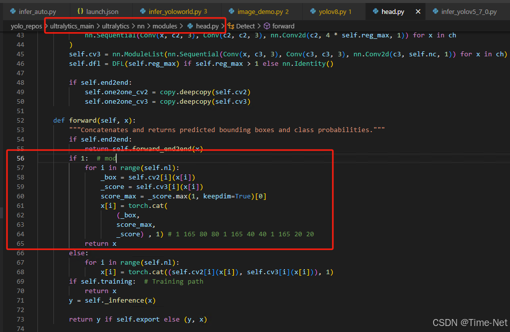

# YOLOv8 for Pytorch

<!--命名规则 {model_name}-{dataset}-{framework}-->

[TOC]

## 模型简介


<!--可选-->
论文地址：[Real-Time Flying Object Detection with YOLOv8](https://arxiv.org/abs/2305.09972)

Github工程地址：https://github.com/ultralytics/ultralytics

数据集（COCO）：https://cocodataset.org/

## 资源准备

1. 数据集资源下载

	COCO数据集是一个可用于图像检测（image detection），语义分割（semantic segmentation）和图像标题生成（image captioning）的大规模数据集。这里需要下载coco128数据集。下载请前往[COCO官网](https://cocodataset.org/)。
2. 模型权重下载

	下载[YOLOv8s权重](https://github.com/ultralytics/assets/releases/download/v8.2.0/yolov8s.pt)

3. 清微github modelzoo仓库下载

	```git clone https://github.com/tsingmicro-toolchain/ts.knight-modelzoo.git```

## Knight环境准备

1. 联系清微智能获取Knight工具链版本包 ```ReleaseDeliverables/ts.knight-x.x.x.x.tar.gz ```。下面以ts.knight-2.0.0.4.tar.gz为例演示。

2. 检查docker环境

	​默认服务器中已安装docker（版本>=19.03）, 如未安装可参考文档ReleaseDocuments/《TS.Knight-使用指南综述_V1.4.pdf》。
	
	```
	docker -v   
	```

3. 加载镜像
	
	```
	docker load -i ts.knight-2.0.0.4.tar.gz
	```

4. 启动docker容器

	```
	docker run -v ${localhost_dir}/ts.knight-modelzoo:/ts.knight-modelzoo -it ts.knight:2.0.0.4 /bin/bash
	```
	
	localhost_dir为宿主机目录。

## 快速体验

在docker 容器内运行以下命令:

```
cd /ts.knight-modelzoo/pytorch/builtin/cv/detection/
```

```
sh yolov8s/scripts/run.sh
```

## 模型部署流程

### 1. 量化

-   模型准备
	
在ultralytics/nn/modules/head.py里修改如上图所示,分别增加上述三行。将src目录下文件放置在所下载的工程内，将所下载目录设置进PYTHONPATH。
	

-   量化数据准备

    这里使用[COCO128](https://github.com/ultralytics/yolov5/releases/download/v1.0/coco128_with_yaml.zip)数据集作为量化校准数据集, 通过命令行参数```-i 128```指定图片数量,```-d```指定coco128.yaml所在的路径。

-   模型转换函数、推理函数准备
	
	已提供量化依赖的模型转换和推理函数py文件: ```/ts.knight-modelzoo/pytorch/builtin/cv/detection/yolov8s/src/yolov8s.py```

-   执行量化命令

	在容器内执行如下量化命令，生成量化后的文件 yolov8s_quantize.onnx 存放在 -s 指定输出目录。

    	Knight --chip TX5368AV200 quant onnx -m yolov8s
    		-w /ts.knight-modelzoo/pytorch/builtin/cv/detection/yolov8s/weight/yolov8s.pt
    		-f pytorch 
    		-uds /ts.knight-modelzoo/pytorch/builtin/cv/detection/yolov8s/src/yolov8.py 
    		-if yolov8s
			-s ./tmp/yolov8s
    		-d /ts.knight-modelzoo/pytorch/builtin/cv/detection/yolov8s/data/coco128.yaml
    		-bs 1 -i 128


### 2. 编译


    Knight --chip TX5368AV200 rne-compile --onnx yolov8_quantize.onnx --outpath .


### 3. 仿真

    #准备bin数据
    python3 src/make_image_input_onnx.py  --input /ts.knight-modelzoo/pytorch/builtin/cv/detection/yolov8/data/coco128/images --outpath . 
    #仿真
    Knight --chip TX5368AV200 rne-sim --input model_input.bin --weight yolov8_quantize_r.weight --config  yolov8_quantize_r.cfg --outpath .

### 4. 性能分析

```
Knight --chip TX5368AV200 rne-profiling --weight yolov8_quantize_r.weight --config  yolov8_quantize_r.cfg --outpath .
```

### 5. 仿真库

### 6. 板端部署


## 支持芯片情况

| 芯片系列                                          | 是否支持 |
| ------------------------------------------------ | ------- |
| TX510x                                           | 支持     |
| TX5368x_TX5339x                                  | 支持     |
| TX5215x_TX5239x200_TX5239x220 | 支持     |
| TX5112x201_TX5239x201                            | 支持     |
| TX5336AV200                                      | 支持     |


## 版本说明

2023/11/23  第一版


## LICENSE

ModelZoo Edge 的 License 具体内容请参见LICENSE文件

## 免责说明

您明确了解并同意，以上链接中的软件、数据或者模型由第三方提供并负责维护。在以上链接中出现的任何第三方的名称、商标、标识、产品或服务并不构成明示或暗示与该第三方或其软件、数据或模型的相关背书、担保或推荐行为。您进一步了解并同意，使用任何第三方软件、数据或者模型，包括您提供的任何信息或个人数据（不论是有意或无意地），应受相关使用条款、许可协议、隐私政策或其他此类协议的约束。因此，使用链接中的软件、数据或者模型可能导致的所有风险将由您自行承担。


