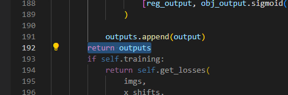

# YOLOX for Pytorch

<!--命名规则 {model_name}-{dataset}-{framework}-->

[TOC]

## 模型简介

<!--可选-->
论文地址：[YOLOX: Exceeding YOLO Series in 2021](https://arxiv.org/abs/2107.08430)

Github工程地址：https://github.com/Megvii-BaseDetection/YOLOX

数据集（COCO）：https://cocodataset.org/

## 资源准备

1. 数据集资源下载

	COCO数据集是一个可用于图像检测（image detection），语义分割（semantic segmentation）和图像标题生成（image captioning）的大规模数据集。下载请前往[COCO官网](https://cocodataset.org/)。

2. 模型权重下载

	下载[YOLOxs权重](https://github.com/Megvii-BaseDetection/YOLOX/releases/download/0.1.1rc0/yolox_s.pth)

3. 清微github modelzoo仓库下载

	```git clone https://github.com/tsingmicro-toolchain/ts.knight-modelzoo.git```

## Knight环境准备

1. 联系清微智能获取Knight工具链版本包 ```ReleaseDeliverables/ts.knight-x.x.x.x.tar.gz ```。下面以ts.knight-2.0.0.4.tar.gz为例演示。

2. 检查docker环境

	​默认服务器中已安装docker（版本>=19.03）, 如未安装可参考文档ReleaseDocuments/《TS.Knight-使用指南综述_V1.4.pdf》。
	
	```
	docker -v   
	```

3. 加载镜像
	
	```
	docker load -i ts.knight-2.0.0.4.tar.gz
	```

4. 启动docker容器

	```
	docker run -v ${localhost_dir}/ts.knight-modelzoo:/ts.knight-modelzoo -it ts.knight:2.0.0.4 /bin/bash
	```
	
	localhost_dir为宿主机目录。

## 快速体验

在docker 容器内运行以下命令:

```
cd /ts.knight-modelzoo/pytorch/builtin/cv/detection/
```

```
sh yoloxs/scripts/run.sh
```

## 模型部署流程

### 1. 量化


-   推理函数准备
	
	如上图修改yolox/models/yolo_head.py。已提供量化依赖的模型推理函数py文件: ```/ts.knight-modelzoo/pytorch/builtin/cv/detection/yoloxs/src/infer_yolovx_small.py```,放入下载的工程内。
	执行`python3 tools/export_onnx.py --output-name yolox_s.onnx -n yolox-s -c yolox_s.pth` 进行onnx模型转换。如报错，请检查环境变量是否正确设置。

-   执行量化命令

	在容器内执行如下量化命令，生成量化后的文件存放在 -s 指定输出目录,-d指定下载的coco数据集根目录，-uds指定infer_yolovx_small.py所在的工程目录路径。
    	Knight --chip TX5368AV200 quant onnx -m yolox_s.onnx 
    		-uds /path/to/your/infer_yolovx_small.py 
			-d /path/to/your/data_coco_dir
    		-if infer_yolox_small
			-s ./tmp/yoloxs
    		-bs 1 -i 128


### 2. 编译


    Knight --chip TX5368AV200 rne-compile --onnx yolox_s_quantize.onnx --outpath .


### 3. 仿真

    #准备bin数据
    python3 src/make_image_input_onnx.py  --input /ts.knight-modelzoo/pytorch/builtin/cv/detection/yoloxs/data/images/train2017 --outpath . 
    #仿真
    Knight --chip TX5368AV200 rne-sim --input model_input.bin --weight yolox_s_quantize_r.weight --config  yolox_s_quantize_r.cfg --outpath .

### 4. 性能分析

```
Knight --chip TX5368AV200 rne-profiling --weight yolox_s_quantize_r.weight --config  yolox_s_quantize_r.cfg --outpath .
```

### 5. 仿真库

### 6. 板端部署


## 支持芯片情况

| 芯片系列                                          | 是否支持 |
| ------------------------------------------------ | ------- |
| TX510x                                           | 支持     |
| TX5368x_TX5339x                                  | 支持     |
| TX5215x_TX5239x200_TX5239x220 | 支持     |
| TX5112x201_TX5239x201                            | 支持     |
| TX5336AV200                                      | 支持     |


## 版本说明

2023/11/23  第一版


## LICENSE

ModelZoo Edge 的 License 具体内容请参见LICENSE文件

## 免责说明

您明确了解并同意，以上链接中的软件、数据或者模型由第三方提供并负责维护。在以上链接中出现的任何第三方的名称、商标、标识、产品或服务并不构成明示或暗示与该第三方或其软件、数据或模型的相关背书、担保或推荐行为。您进一步了解并同意，使用任何第三方软件、数据或者模型，包括您提供的任何信息或个人数据（不论是有意或无意地），应受相关使用条款、许可协议、隐私政策或其他此类协议的约束。因此，使用链接中的软件、数据或者模型可能导致的所有风险将由您自行承担。


